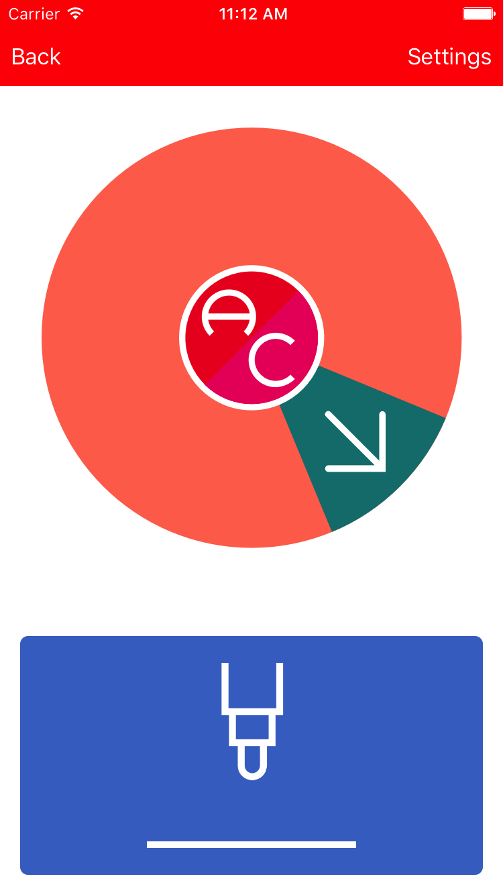

# ButtonDraw

iOS App to control a [MakeBlock XY-Plotter Robot](http://store.makeblock.com/xy-plotter-robot-kit/), specifically designed for a switch access headset.

## Screenshot

## Requirements

* [Xcode](https://developer.apple.com/xcode/download/)
* [Cocoapods](https://cocoapods.org/)

## Installation Instructions

1. Download the [source code](https://github.com/akramhussein/button-draw)

  `$ git clone git@github.com:akramhussein/button-draw.git`

2. Install [cocoapods](https://cocoapods.org/)

  `$ cd ./ButtonDraw && pod install`

3. Open "ButtonDraw.xcworkspace" in Xcode

4. Open Xcode's Preferences > Accounts and add your Apple ID

5. In Xcode's sidebar select "ButtonDraw" and go to Targets > ButtonDraw > General > Identity and add a word to the end of the Bundle Identifier to make it unique. Also select your Apple ID in Signing > Team

6. Connect your iPad or iPhone and select it in Xcode's Product menu > Destination

7. Press CMD+R or Product > Run to install ButtonDraw

## License

button-draw is available under the MIT License
